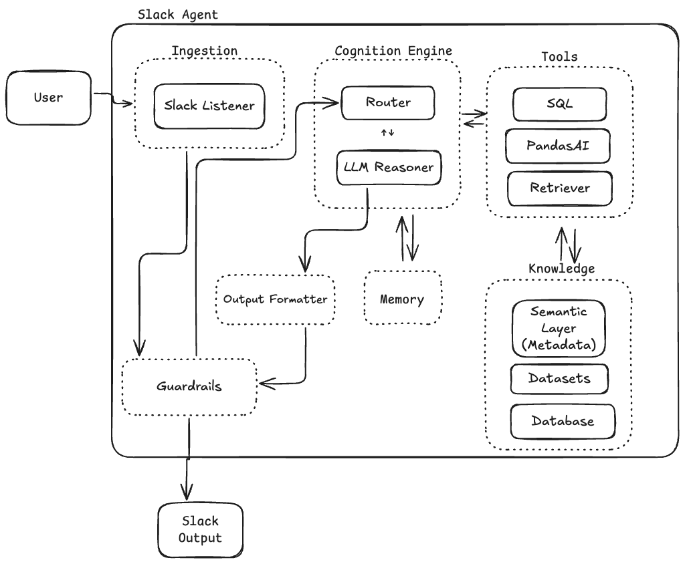

# GenAI DataOps Agent


A **production-grade, modular GenAI analytics agent** that processes natural-language analytical questions, routes them intelligently through SQL/PandasAI/LLM tools, applies guardrails, and returns formatted insights (tables, metrics, charts).  

Designed to work with **Slack (default)** but fully interface-agnostic — can be swapped for **API, Teams, Email, CLI, nodeJS.**.

This project is built using DataOps/GenAI principles, designed for **real-world enterprise deployment** with Docker, GitHub Actions, MCP integration, and extensible data toolchains.

---

## 1. Features

### 🔹 Universal Analytics Engine  
- Query SQL databases  
- Run PandasAI dataframe analysis + charts  
- Use semantic layer for accurate metric interpretation  
- LLM reasoning with memory + guardrails  
- Subsystem routing for intelligent tool dispatching  

### 🔹 Interface-Agnostic 
Designed so the ingestion/output interface can be switched with:
- Slack  
- Email / Gmail  
- API Gateway  
- Teams  
- Command Line  
- React / Next.js frontend 

### 🔹 Production-Ready Components  
- Fully modular code structure (src/agent/…)  
- Clean subsystem boundaries  
- Cognitive loop + router  
- Input and output guardrails  
- Tools engine + knowledge store separation  

### 🔹 DevOps-Ready  
- Dockerfile included  
- GitHub Actions-compatible structure  
- Poetry environment  
- Local + Cloud version supported  
- MCP client ready for SQL, metadata, and file operations  

---
## 2. Core Capabilities

This agent supports:

### 🔹 Flexible Input Interfaces
Works with Slack today, but easily replaceable with:
- REST API
- Teams
- Email
- CLI
- React / Next.js UI

### 🔹 Input Guardrails
Prevents dangerous, impossible, or system-breaking queries:
- Rejects unbounded time ranges (“all logs for 3 years”)  
- Detects unsafe SQL patterns  
- Ensures questions match available metrics  
- Normalizes text before routing  

### 🔹 Cognition Engine
A modular “thinking loop”:
- **Router** — decides which tool to use
- **LLM Reasoner** — interprets intent, decomposes complex tasks
- **Memory** — short-term (conversation) + long-term (context hints)

### 🔹 Tools Engine
Executes actions:
- **SQL Tool** — fast structured queries
- **PandasAI Tool** — charts, visual analytics, transformations
- **Retriever Tool (stub)** — for future RAG + vector DB
- **MCP Client** — bridges external capabilities

### 🔹 Knowledge Store
The system’s “truth”:
- **Semantic Layer** → metric definitions  
- **Datasets** → CSV/Parquet for PandasAI  
- **Database** → Postgres (Render / local)

### 🔹 Output Layer
- Output formatter (tables, summaries, charts)
- Output guardrails (safety + correctness)
- Slack message response  
---

## 3. System Architecture 


The diagram shows subsystem boundaries and how components communicate inside the Agent.

### 🔹 Subsystem Architecture 

| Subsystem | Responsibilities |
|----------|------------------|
| **Ingestion** | Receives Slack messages (or API input), applies input guardrails |
| **Cognition Engine** | Router, LLM reasoning, memory → determines best action |
| **Tools Engine** | SQL queries, PandasAI analysis, Retriever + MCP tools |
| **Knowledge Store** | Semantic layer metadata, datasets, Postgres |
| **Output Module** | Formatting, safety filtering, Slack responses |


### 🔹 Data Flow logic
```text
Slack → Input Guardrails → Router
Router ↔ LLM Reasoner
Router ↔ Memory
LLM Reasoner ↔ Tools
Tools ↔ Database/Datasets
Semantic Layer → Tools (one-direction metadata)
LLM Reasoner → Output Formatter → Output Guardrails → Slack Output
```


This diagram shows runtime flow of a single user request from input → cognition → tools → output.

---
## 4. 📂 Project Structure

```
project-root/
├── README.md
├── AGENTS.md
├── PROJECT_CONTEXT.md
├── .env
├── pyproject.toml
├── Dockerfile
├── .dockerignore
├── .gitignore
│
└── src/
└── agent/
├── main.py
│
├── ingestion/
│ ├── listener.py
│ └── input_guardrails.py
│
├── cognition/
│ ├── router.py
│ ├── llm_reasoner.py
│ └── memory.py
│
├── tools/
│ ├── sql_tool.py
│ ├── pandasai_tool.py
│ ├── retriever_tool.py
│ └── mcp_client.py
│
├── knowledge/
│ ├── semantic_layer.yaml
│ ├── dataset_loader.py
│ └── database.py
│
└── output/
├── formatter.py
└── output_guardrails.py
```

---

## 5. 🛠️ Technologies Used

| Layer | Technology |
|-------|------------|
| Language | Python 3.11 |
| Package Manager | Poetry |
| AI/LLM | OpenAI / LiteLLM |
| Analytics | PandasAI |
| Interface | Slack Bolt SDK |
| Database | Postgres (Render / local) |
| Packaging | Docker |
| Dev Safety | Ruff + Black |
| Future Expansion | MCP, RAG, S3, Vector DB |

## 6.🔒 Guardrails (Safety Layer)

The agent includes:

Input Guardrails
Prevent long-running queries, unsafe requests, unbounded date ranges, invalid metrics.

Output Guardrails
Prevent hallucinations, unsafe content, and formatting issues.

---

## 7. Quick Start

- Install dependencies
- Activate environment
- Add environment vars:
  - SLACK_BOT_TOKEN=
  - SLACK_SIGNING_SECRET=
  - OPENAI_API_KEY=
  - DB_CONNECTION_STRING=
- Run the agent
  - python src/agent/main.py

---

## 8. Testing

Tests will live under `/test` and cover:

- Router logic
- Guardrails
- SQL and PandasAI tool dispatch
- End-to-end Slack message simulation

---

## 9. Roadmap

- [ ] Add Retriever Tool with RAG + VectorDB
- [ ] Add S3/Athena integration 
- [ ] Support Teams/Web/Email interfaces
- [ ] Add GitHub Actions CI/CD
- [ ] Add UI dashboard
- [ ] Add benchmarking + evaluation tests
