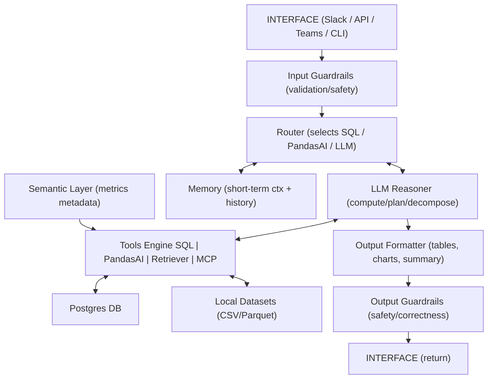

```mermaid
%%{init: {'theme':'default', 'flowchart': { 'nodeSpacing': 20, 'rankSpacing': 20 }}}%%

flowchart TD
A["INTERFACE (Slack / API / Teams / CLI)"] --> B["Input Guardrails (validation/safety)"]
B --> C["Router (selects SQL / PandasAI / LLM)"]
C <--> D["LLM Reasoner (compute/plan/decompose)"]
C <--> E["Memory (short-term ctx + history)"]
D <--> F["Tools Engine SQL | PandasAI | Retriever | MCP"]
F <--> G["Postgres DB"]
F <--> H["Local Datasets (CSV/Parquet)"]
I["Semantic Layer (metrics metadata)"] --> F
D --> J["Output Formatter (tables, charts, summary)"]
J --> K["Output Guardrails (safety/correctness)"]
K --> L["INTERFACE (return)"]
```